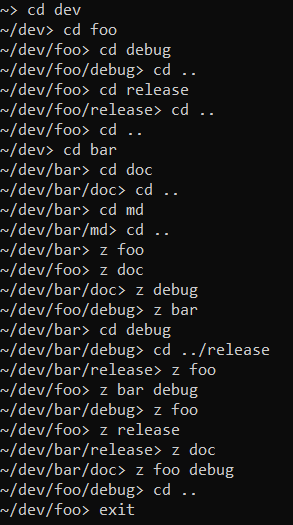

# Zsh

*z.sh* "port" to C++.

Beware! Only the logic has been ported, not the actual integration with the shell. A fake "shell" is provided as a example but only to demonstate the api.

## What is it?

`Zsh` tracks most used items (via `add()` function) and gets the most used item based on 'frecency'. After a short "learing" period it will return the item that matches all the supplied regexes.

### Aging
The rank of directories maintained by `Zsh` undergoes aging based on a simple formula. The rank of each entry is incremented every time it is
accessed. When the sum of ranks reaches a certain value (or always if not set), all ranks are decreased by 1%. Entries with a rank lower than 1 are forgotten.

### Frecency
Frecency is a portmanteau of 'recent' and 'frequency'. It is a weighted
rank that depends on how often and how recently something occurred. As
far as `rupa`, the original author, knows, Mozilla came up with the term.

To `Zsh`, a item that has low ranking but has been accessed recently
will quickly have higher rank than a directory accessed frequently a
long time ago.

Frecency is determined at runtime.

Original implementation can be found at [https://github.com/rupa/z](https://github.com/rupa/z).
